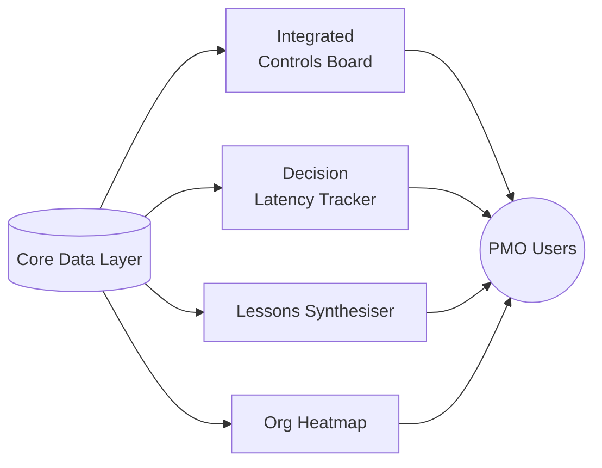

# PMO Prototype Suite for GitHub Pages

*Version 0.1 – scaffold only*

---

## 0  Overview

This repository contains **four lightweight, client-side web apps** that can be published straight to **GitHub Pages** (no server, no build step). Each is a self-contained folder with a single *index.html*, minimal CSS, a tiny JSON file with mock data, and vanilla JavaScript that calls Chart.js or D3 from public CDNs. The goal is to give your client a tactile proof-of-concept they can click through today while leaving plenty of runway for richer React or API-driven versions later.

```
repo-root/
│  README.md   ← this file
├─ controls-command-board/
│    │  index.html
│    └─ data.json
├─ decision-latency-tracker/
│    │  index.html
│    └─ data.json
├─ lessons-synthesiser/
│    │  index.html
│    └─ lessons.json
├─ org-heatmap-tracker/
│    │  index.html
│    └─ heatmap.json
└─ landscape-diagram/
     └─ controls-landscape.md (Mermaid)
```

Deploy by pushing to the **main** branch and enabling GitHub Pages → *Deploy from branch* → */ (root)*. Each folder is then reachable at:

```
https://<org>.github.io/<repo>/controls-command-board/
```

---

## 1  Integrated Controls Command Board (ICC Board)

### Purpose

Single-screen fusion of **baseline vs actual cost/schedule**, **FTE utilisation**, and **process efficiency KPIs**.

### index.html (excerpt)

```html
<!DOCTYPE html>
<html>
<head>
  <meta charset="utf-8" />
  <title>Integrated Controls Command Board</title>
  <script src="https://cdn.jsdelivr.net/npm/chart.js"></script>
  <link rel="stylesheet" href="https://cdn.jsdelivr.net/npm/charts.css/dist/charts.min.css" />
  <style>body{font-family:sans-serif;margin:2rem;}canvas{max-width:800px;}</style>
</head>
<body>
  <h1>Integrated Controls Command Board</h1>
  <canvas id="costChart"></canvas>
  <canvas id="fteChart"></canvas>
  <canvas id="effChart"></canvas>
<script type="module">
(async () => {
const data = await fetch('./data.json').then(r => r.json());
// Cost vs baseline
new Chart(costChart, {type:'line',data:{labels:data.periods,datasets:[{label:'Baseline £m',data:data.baseline},{label:'Actual £m',data:data.actual}]}});
// FTE utilisation
new Chart(fteChart, {type:'bar',data:{labels:data.periods,datasets:[{label:'Planned',data:data.fte_planned},{label:'Actual',data:data.fte_actual}]}});
// Efficiency KPI
new Chart(effChart, {type:'radar',data:{labels:['Reporting','Gate Prep','Change Ctrl','Risk'],datasets:[{label:'Eff %',data:data.efficiency}]}});
})();
</script>
</body></html>
```

### data.json (sample)

```json
{
  "periods": ["Jan","Feb","Mar","Apr"],
  "baseline": [20, 40, 60, 80],
  "actual":   [22, 39, 65, 90],
  "fte_planned": [120,130,140,150],
  "fte_actual":  [118,135,150,160],
  "efficiency": [84,78,91,87]
}
```

---

## 2  Decision Latency Tracker

Tracks the elapsed time from **first signal → decision closure** for change requests, risk mitigations, and approvals.

### index.html (excerpt)

```html
<!DOCTYPE html>
<html><head><meta charset="utf-8">
<script src="https://cdn.jsdelivr.net/npm/chart.js"></script>
<style>canvas{max-width:900px;margin-top:2rem}</style></head>
<body>
<h1>Decision Latency Tracker</h1>
<canvas id="latency"></canvas>
<script type="module">
(async () => {
const data = await fetch('./data.json').then(r => r.json());
new Chart(latency,{type:'bar',options:{indexAxis:'y'},data:{labels:data.items.map(i=>i.name),datasets:[{label:'Days to Decision',data:data.items.map(i=>i.days)}]}});
})();
</script></body></html>
```

### data.json

```json
{ "items": [
  {"name":"CR‑001 Budget Shift","days":14},
  {"name":"Risk Mit A27","days":9},
  {"name":"Design Change P45","days":21}
]}
```

---

## 3  Lessons-to-Action Synthesiser

Searchable catalogue of lessons, tagged by gateway, theme, and discipline, with quick copy-to-clipboard summaries.

### index.html (excerpt)

```html
<!DOCTYPE html>
<html><head><meta charset="utf-8"><style>body{font-family:sans-serif}input{width:60%}</style></head>
<body>
<h1>Lessons-to-Action Synthesiser</h1>
<input id="q" placeholder="search…" oninput="filter()"><ul id="list"></ul>
<script type="module">
(async () => {
const lessons = await fetch('./lessons.json').then(r => r.json());
const list=document.getElementById('list');
function render(arr){list.innerHTML='';arr.forEach(l=>{const li=document.createElement('li');li.textContent=`[${l.tag}] ${l.text}`;list.appendChild(li);});}
function filter(){const f=q.value.toLowerCase();render(lessons.filter(l=>l.text.toLowerCase().includes(f)||l.tag.toLowerCase().includes(f)));}
render(lessons);
})();
</script></body></html>
```

### lessons.json (sample)

```json
[
 {"tag":"Gateway 2","text":"Define risk appetite early and agree contingencies."},
 {"tag":"Procurement","text":"Involve commercial early to avoid long‑lead items."}
]
```

---

## 5  Organisational Heatmap & Efficiency Tracker

Maps teams vs processes with colour-coded utilisation; supports hover drill-downs.

### index.html (excerpt)

```html
<!DOCTYPE html>
<html><head><meta charset="utf-8"><script src="https://cdn.jsdelivr.net/npm/d3@7"></script><style>svg{font:10px sans-serif}</style></head>
<body>
<h1>Org Heatmap & Efficiency</h1>
<svg id="heat" width="600" height="400"></svg>
<script type="module">
(async () => {
const grid = await fetch('./heatmap.json').then(r => r.json());
const svg=d3.select('#heat');
const cell=40;
svg.attr('height',cell*grid.teams.length+40).attr('width',cell*grid.processes.length+120);
// axes
svg.selectAll('text.team').data(grid.teams).enter().append('text').attr('x',0).attr('y',(d,i)=>i*cell+cell*1.3).text(d=>d);
svg.selectAll('text.proc').data(grid.processes).enter().append('text').attr('x',(d,i)=>i*cell+60).attr('y',10).attr('transform',(d,i)=>`rotate(-40 ${(i*cell+60)},10)`).text(d=>d);
// cells
grid.values.forEach((row,r)=>row.forEach((v,c)=>{
  svg.append('rect').attr('x',c*cell+50).attr('y',r*cell+20).attr('width',cell-2).attr('height',cell-2)
    .attr('fill',`rgba(0,128,255,${v/100})`).append('title').text(`${v}% utilisation`);
}));
})();
</script></body></html>
```

### heatmap.json (sample)

```json
{
  "teams":["Design","Commercial","PMO"],
  "processes":["Reporting","Change","Risk","Assurance"],
  "values":[[85,70,60,55],[60,90,45,50],[40,60,95,80]]
}
```

---

## 6  Digital Controls Landscape Diagram

Render with [Mermaid](https://mermaid.js.org) (works offline via `https://cdn.jsdelivr.net/npm/mermaid@10/dist/mermaid.esm.min.mjs`).



Embed this Markdown file anywhere in the repo (or copy its SVG export) to show the end-to-end ecosystem.

---

## 7  Why this stack?

* **Zero backend** – runs entirely on GitHub Pages, perfect for secure air-gapped demo.
* **CDN-loaded libs** – Chart.js & D3 keep pages lightweight (<100 kB each).
* **Progressive enhancement** – swap JSON mocks for live API calls later, or wrap in React/Vite for larger deployments.
* **Human-first design** – each app surfaces insights that remove toil and support better judgement, aligning with the client’s ‘intelligence fusion cell’ vision.
